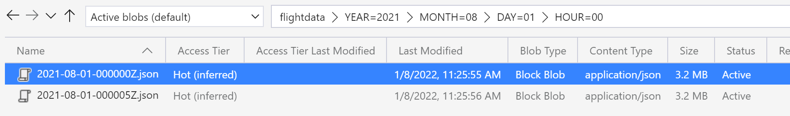

## Index Geo Flight Data in Azure Search using the Push Mechanism

**Pre-requisites steps:**
 - Azure subscription
 - Azure Search Service 
 - Azure Storage account (+ container created)
 - Upload data into the container
 - Python installed
 - Install the following Python library https://pypi.org/project/azure-search-documents/


**Structure of repo:**
- **data folder** - container two json files extracted from their respective .gz files which were downloaded from https://samples.adsbexchange.com/readsb-hist/2021/08/01/
- **config.json** - here is where you configure the search service name, key, index name and index schema file, storage account connection string, container name, and batch size
--- **batch size** - dictates the number of documents (json lines) to send to Azure Search index per request (max 1000 docs or 16 MB per batch per request)
- **geodata-schema.json** - contains the schema of the index which defines the fields, their types and other attirbutes such as whether they're searchable, retrievable, facetable and so forth
- pushgeodata.py - is the executable python file that download each json file from Azure Storage to the memory of the local environment and goes through each line of the json file and pushes the json documents to the index

**Upload data to Azure Storage container**
- Use Storage Explorer https://azure.microsoft.com/en-us/features/storage-explorer/#overview to upload the two json files from the data folder into a namespace(i.e. folder) structure as follows:
```shell
YEAR=2021/MONTH=08/DAY=01/HOUR=00/
```
This is how it will end up looking in Azure Storage Explorer:


**Executing the indexing**
- Open a terminal or command line window and run:
```shell
python pushgeodata.py 2021 08 01 00
```
The arguments required are:
- YEAR
- MONTH
- DAY
- HOUR

These will map to the namespace structure in the Azure Storage account container.


